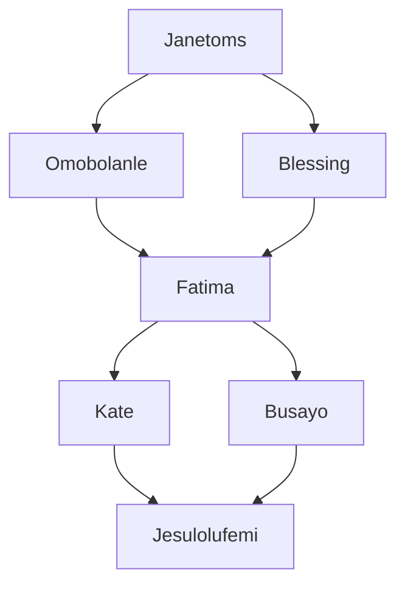

# GROUP 1 PROJECT - Rest API and Agify API

# Overview of the project
**Agify API:**  How do you tell the age of someone from their name? Well, here is a fun little API that you can use. Agify is used for predicting the age of a person given their name. It is free to use for up to 1000 requests/day. Agify API was used to predict the ages of Group 1 members.

**Rest Countries:** Thinking about building an application where you will need data about different countries of the world? Here is the API you will need. The REST Countries Project involves retrieving and presenting comprehensive data about countries. This API provides a wealth of data, including population, timezones, languages spoken, and more. Rest Countries was used to suggest Vacation spots in different countries.

## How to run the code 
1. **Clone the repository** - git clone https://github.com/KateRasheed/Group_1_Project_RestCountriesAPI_AgifyAPI.git
2. **Change Directory in to the file** - cd Group_1_Project_RestCountriesAPI_AgifyAPI
3. **Run the program** - python Rest_Age.py
4. **Follow the prompt to enter desired country**
   

# Collaborators and assigned tasks
Thanks goes to these wonderful people.

 
1. Fatima - Import status and calling out the response
2. Kate and Busayo - Writing it to text file; Agify
3. Blessing - Added user- input to the rest_api function
4. Omobolanle - Defined the rest function
5. Janetoms - Writing it to text file; Rest countries
6. Jesulolufemi - Added comments to both APIs and worked on the readme file
